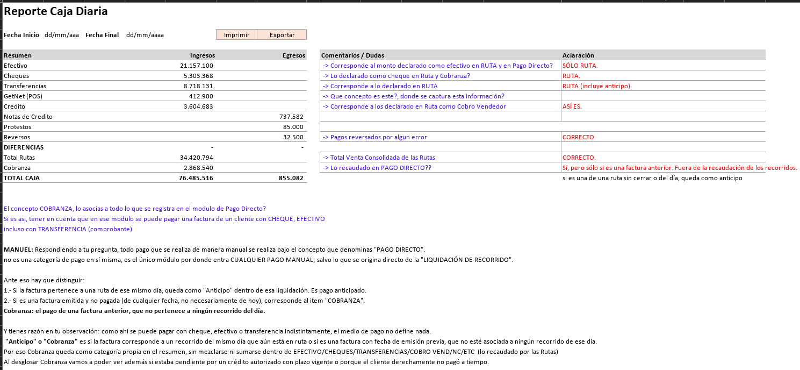

# Vista Resumen

**Respuesta primero:** el resumen lista ingresos (efectivo a GetNet y crédito), egresos (NC, protestos, reversos, diferencias), Total Rutas, Cobranza y Total Caja. Desde Resumen no se abre el modal: el detalle se abre en la vista Detalle.


**Cifras ilustrativas:** los montos, choferes y usuarios de esta página son cifras ilustrativas del prototipo (datos simulados, commit 2ce55a3b). No son datos reales ni cifras validadas.



**Confirmado:** columnas Concepto, Ingresos y Egresos, y el orden de las líneas según el levantamiento y la maqueta del cliente. El color rojo y el signo “-” son comportamiento del prototipo. El modal no se abre desde esta vista ([Q-13](../preguntas-pendientes.md#q-13)). Diferencias sigue en P-02.


## Orden de líneas (confirmado)

1. Efectivo — solo ruta  
2. Cheques — solo ruta  
3. Transferencias — ruta, anticipos y transferencia por corroborar  
4. GetNet  
5. Crédito (cobro vendedor)  
6. Notas de crédito (egreso)  
7. Protestos (egreso)  
8. Reversos (egreso)  
9. Diferencias (egreso)  
10. Total Rutas (informativo)  
11. Cobranza  
12. Total Caja  

## Maqueta del cliente (referencia)

<figure><figcaption>
Maqueta del cliente (referencia). No es una captura del prototipo.
</figcaption></figure>

En la maqueta y el Excel del cliente aparece **76.485.516** como Total Caja: trátalo como **valor del Excel del cliente, en revisión** (posible doble conteo con Total Rutas). Ver [Q-06](../preguntas-pendientes.md#q-06) y [Q-07](../preguntas-pendientes.md#q-07).


**Por validar:** fórmula real de Total Caja (¿incluye Total Rutas? ¿incluye Crédito como dinero en caja?). El prototipo calcula ingresos − egresos **sin** sumar Total Rutas → neto ilustrativo **19.761.186** (supuesto del prototipo).



**Captura pendiente:** falta agregar la captura del prototipo para vista Resumen. Mientras tanto, revisa la maqueta en la ruta Finanzas > Caja Diaria.


## Cómo revisarla



### Orden y maqueta

Revisa el orden de las líneas contra la maqueta del cliente y la tabla de [Líneas del reporte](../referencia/lineas-del-reporte.md).



### Egresos en rojo

Confirma los egresos en rojo con “-” en el prototipo.



### Sin modal en Resumen

Confirma que un clic en una línea del resumen no abre modal. El detalle se revisa en [Vista Detalle y modales](03-vista-detalle-y-modales.md).



### Total Caja

Contrasta Total Caja con [Q-06](../preguntas-pendientes.md#q-06); no uses 76.485.516 como regla confirmada.



Siguiente: [Vista Detalle y modales](03-vista-detalle-y-modales.md).
