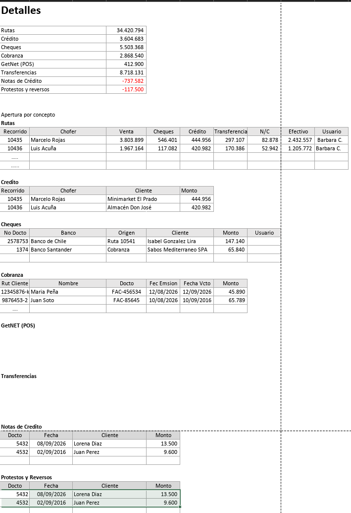

# Vista Detalle y modales

**Respuesta primero:** la vista Detalle muestra una sola tabla Descripción/Monto. El modal de un concepto se abre **solo desde aquí**, no desde Resumen. GetNet no abre modal mientras no esté definida su tabla de detalle.


**Cifras ilustrativas:** los montos, choferes y usuarios de esta página son cifras ilustrativas del prototipo (datos simulados, commit 2ce55a3b). No son datos reales ni cifras validadas.



**Supuesto del prototipo:** tabla única + modal XL (decisión de prototipo tras feedback); levantamiento permite modal o sección inferior (L §4 Navegación).


## Filas en Detalle (prototipo)

Rutas, Efectivo, Cheques, Transferencias, Crédito, Cobranza, GetNet, Notas de crédito, Protestos, Reversos, Total Caja. **No** hay fila Diferencias en Detalle. Egresos en rojo con “-”.

## Dónde se abre el modal

| Comportamiento | Resumen | Detalle | Estado |
|----------------|---------|---------|--------|
| Clic en un concepto | No abre modal | Abre el modal de detalle | Confirmado ([Q-13](../preguntas-pendientes.md#q-13)) |
| Clic en GetNet | No abre modal | No abre modal: la tabla de detalle aún no está definida | Confirmado, tabla pendiente ([Q-13](../preguntas-pendientes.md#q-13), [P-01](../preguntas-pendientes.md#p-01)) |

## Maqueta del cliente (referencia)

<figure><figcaption>
Maqueta del cliente (referencia). No es una captura del prototipo.
</figcaption></figure>

Compara columnas con [Columnas de detalle](../referencia/columnas-de-detalle.md) (P-04, Q-09, Q-08).


**Captura pendiente:** falta agregar la captura del prototipo para vista Detalle y modales. Mientras tanto, revisa la maqueta en la ruta Finanzas > Caja Diaria.


## Cómo revisarla



### Abre Detalle

Abre la vista **Detalle** desde el filtro y revisa la lista de conceptos.



### Abre un modal

Haz clic en un concepto (salvo GetNet) para abrir el modal y revisa el título “Detalle &lt;Concepto&gt;”. GetNet no abre modal: su tabla de detalle aún no está definida.



### Columnas

Compara columnas con [Columnas de detalle](../referencia/columnas-de-detalle.md).



### Anota deltas

Anota que el modal solo nace en Detalle y que GetNet queda cerrado hasta definir su tabla ([Q-13](../preguntas-pendientes.md#q-13)).



Siguiente: [Liquidación y control interno](04-liquidacion-control-interno.md).
