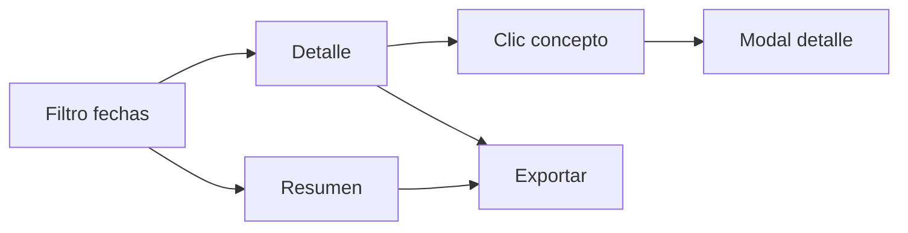

# Visión general

**Respuesta primero:** filtras por fechas, eliges Resumen o Detalle, abres el detalle de un concepto en modal y puedes exportar (simulado); la liquidación de recorrido es donde nace parte del dato vía control interno.


**Confirmado:** navegación en dos niveles (resumen/detalle y clic en concepto) según levantamiento (L §4 Navegación, N-02).


## Recorrido en pasos



### Filtrar

Elige **Fecha Inicio** y **Fecha Final** y la vista **Resumen** o **Detalle**. En producción el rango debe estar acotado (mes o 30 días); el prototipo solo valida inicio ≤ fin.



### Elegir vista

**Resumen** muestra conceptos con columnas Ingresos/Egresos. **Detalle** muestra una tabla única Descripción/Monto por concepto.



### Abrir detalle

Haz clic en un concepto (salvo excepciones como Diferencias o Total Caja en resumen) para abrir el modal con columnas por tipo de movimiento.



### Exportar

Usa **Exportar** (Excel/PDF simulados en el prototipo). Imprimir está pendiente de definir con el cliente ([Q-11](../preguntas-pendientes.md#q-11)).



## Paso a paso con enlaces

| Paso | Qué hace                            | Página                                                              |
| ---- | ----------------------------------- | ------------------------------------------------------------------- |
| 1    | Contexto y alcance del prototipo    | [Alcance del prototipo](../contexto/alcance-prototipo.md)           |
| 2    | Filtros, vistas, exportación        | [Filtros, vistas y exportación](01-filtros-vistas-y-exportacion.md) |
| 3    | Tabla resumen y maqueta cliente     | [Vista Resumen](02-vista-resumen.md)                                |
| 4    | Tabla detalle y modales             | [Vista Detalle y modales](03-vista-detalle-y-modales.md)            |
| 5    | Origen del checkbox control interno | [Liquidación y control interno](04-liquidacion-control-interno.md)  |
| 6    | Cierre de dudas                     | [Preguntas pendientes](../preguntas-pendientes.md)                  |
